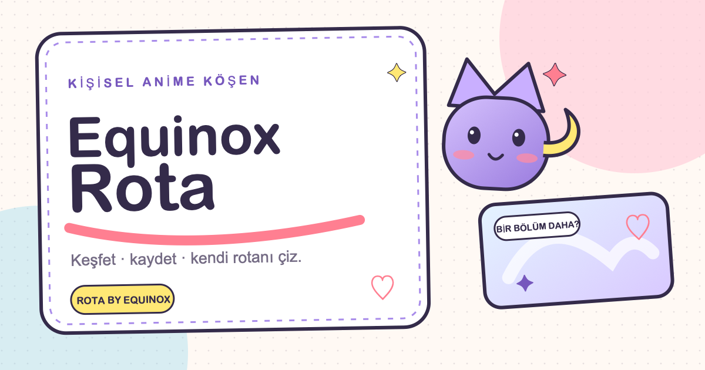

# Equinox Rota

> Rota by Equinox — anime yolculuğunun Türkçe kaydı.

[](https://github.com/sametbasbug/anime.sametbasbug.dev/actions/workflows/ci.yml)
[](https://github.com/sametbasbug/anime.sametbasbug.dev/actions/workflows/codeql.yml)
[](https://github.com/sametbasbug/anime.sametbasbug.dev/actions/workflows/deploy-pages.yml)
[](./LICENSE)

[](https://anime.sametbasbug.dev/)

Equinox Rota, Türkçe anime keşfi, takibi ve kişisel arşivi için local-first bir web ürünüdür. 2.500 yapımlık aranabilir katalog; açıklanabilir kişisel öneriler, kişisel raflar, istatistikler, taşınabilir yedekler, paylaşılabilir profiller ve spoiler kontrollü topluluk incelemeleriyle birlikte çalışır. Video barındırmaz, korsan yayın bağlantısı sunmaz ve izinsiz veri toplamaz.

**Canlı soft alpha:** [anime.sametbasbug.dev](https://anime.sametbasbug.dev/)

## Bugünkü durum

- Mobil öncelikli, responsive ana sayfa
- Açık ve kawaii **Soft Celestial Otaku** tasarım sistemi; manga editoryali, masaüstü üst menüsü, mobil alt gezinme ve tüm bölümlere açılan mobil menü
- Ana sayfada doğrudan katalog araması ve yerel kişisel arşiv özeti
- Gerçek katalogdan üretilen güncel sezon rafı, haftalık dönüşümlü editoryal seçki ve katalog haritası
- Yeni başlayan, devam eden ve yaklaşan yapımları kişisel planla buluşturan açıklanabilir `/sezonlar` panosu
- Duruma göre çalışan anime kartı filtreleri
- Proje içinde CSS ile üretilmiş özgün görsel kompozisyonlar
- 2.500 yapımlık gerçek, aranabilir ve %100 posterli katalog
- Başlık, alternatif ad, stüdyo, Türkçe tür etiketi ve yıla göre arama
- Türkçe tür, format, yayın durumu ve sıralama filtreleri
- 20 Türkçe tür keşif sayfası ve normalize edilmiş stüdyo sayfaları
- Ortak tür, stüdyo, etiket, yıl ve formata göre üretilen benzer yapım önerileri
- Puan, tür, stüdyo, format, liste ve günlük geçmişini yalnız tarayıcıda eşleştiren açıklanabilir `/oneriler` seçicisi; kısa, film, tek sezon ve ruh hâli yolları
- Yayımlanmamış yapımları geriye alan, sonuç niteliği iyileştirilmiş arama sıralaması
- Statik üretilmiş 2.500 anime detay sayfası
- Dört durumlu, tarayıcıda yerel olarak saklanan kişisel anime listesi
- Bölüm ilerlemesi, 1–10 kişisel puan ve 600 karakterlik kişisel not
- Bölüm aralığı, izleme tarihi ve kısa notlarla local-first izleme günlüğü; aylık özet ve takvim
- Günlük ile kişisel arşivden türetilen `/yillik` aylık/yıllık özeti; izleme ritmi, öne çıkanlar, dönüm noktaları ve cihazda üretilen gizlilik kontrollü PNG kartı
- Durumlara ayrılan koleksiyon rafları, sayaçlar, filtreler ve hızlı ilerleme kontrolleri içeren `/listem` ekranı
- Ad, açıklama ve renk kimliğiyle oluşturulan; izleme durumundan bağımsız, tarayıcıda yerel özel koleksiyonlar ve anime detayından çoklu koleksiyon üyeliği
- Manga açılımı ritmine sahip anime detayları ve otaku köşesi olarak tasarlanan hesap ekranı
- Ana ekranlar ile boş, yükleme, hata, senkronizasyon ve kutlama hâllerine göre 100'ü aşkın kısa replikten konuşan marka yüzü ve göksel yoldaş **Rota**
- Mevsimsel renk katmanı, erişilebilir mikro animasyonlar, karakterli sayfa geçişleri, kawaii cursor ve scrollbar
- Rota'nın ortak yüz anatomisini kullanan site ikonu, favicon ve 1200×630 Open Graph/Twitter paylaşım kartı
- 50 güçlü yapım için özgün, spoiler kontrollü Türkçe editoryal profil
- Taslak, editoryal kontrol ve yayımlanmış durumlarını ayıran doğrulamalı içerik akışı
- İsteğe bağlı **Equinox Orbit** girişi (Supabase'de `custom:orbit` OIDC sağlayıcısı); profil ve liste görünürlüğü ekranı
- Yerel listeyi, izleme günlüğünü ve özel koleksiyonları koruyan tombstone destekli Supabase senkronizasyon katmanı
- Sahip kullanıcıyla sınırlı Postgres RLS migration'ı
- Anime başına tek topluluk incelemesi, spoiler perdesi, özel rapor kuyruğu ve rol korumalı moderasyon arayüzü
- E-posta, kullanıcı UUID'si ve senkronizasyon metadatasını açmayan dar RPC üzerinden salt okunur Rota paylaşım bağlantıları
- Toplam anime/bölüm, izleme süresi, tamamlama oranı, ortalama puan ve tür/stüdyo dağılımı üreten kişisel istatistikler
- Liste, günlük ve koleksiyonları taşıyan JSON yedek v3; okunabilir CSV dışa aktarımı ve yenisi-kazanır kurallı güvenli geri yükleme
- Dependabot, CodeQL ve her değişiklikte tam kontrol/build çalıştıran GitHub Actions bakım hattı
- Astro static build

## Teknik temel

- Astro 7
- React 19
- TypeScript strict mode
- Node.js 24 LTS (CI ve production build)
- Supabase Auth + Postgres + RLS (hesap ve kullanıcı verisi)
- Sıfır UI framework bağımlılığı; görsel sistem proje içinde

Onaylanan ürün deneyimi ve görsel sistem ilkeleri [`docs/DESIGN_DIRECTION.md`](./docs/DESIGN_DIRECTION.md) içinde kanonik olarak tutulur.

## Yerel geliştirme

```bash
npm ci
cp .env.example .env
npm run dev
npm run check
npm run build
```

Yerel geliştirme adresi varsayılan olarak `http://localhost:4321` olur. Supabase değerleri olmadan hesap özellikleri güvenli biçimde devre dışı kalır; katalog ve local-first kişisel liste çalışmaya devam eder. Katalog yenilemek için `npm run data:refresh`, yalnız editoryal doğrulama için `npm run content:check` kullanılabilir.

CI, pull request ve `main` push'larında Node.js 24 üzerinde `npm ci` ile tam static build alır. Production deploy yalnız `main` üzerinden GitHub Pages'e yapılır.

## Katalog verisi

Anime metadata, poster ve kapaklarının tek harici kaynağı [Kitsu](https://kitsu.io/) REST API ve Kitsu media CDN'dir. Rota, GitHub Pages'in statik çalışma modeli için yalnız kullandığı normalize alanları `src/data/catalogue.json` içinde sürüm kontrollü bir ürün indeksi olarak tutar; ham API yanıtlarını veya görsel dosyalarını aynalamaz.

```bash
npm run data:refresh
```

Komut kararlı `src/data/kitsu-catalogue-seed.json` seçkisini Kitsu API'den yeniden çeker, şemaya normalize eder ve ancak 2.500 kaydın tamamı geçerli bir Kitsu posteriyle geldiyse `src/data/catalogue.json` dosyasını yeniler. Timeout, sınırlı retry ve `Retry-After` desteği vardır; eksik veya postersiz yenileme mevcut sağlam katalogu ezmez. Arama verisi `/data/catalogue.json` üzerinden istemciye sunulur, detay sayfaları derleme sırasında statik oluşturulur. `npm run catalogue:check` veri sözleşmesini, `npm run kitsu:media-check` CDN erişimini denetler.

AniList'in güncel kullanım koşulları, açık yetkilendirme ve sürdürülen eşzamanlama olmadan AniList ile rekabet eden liste/takip hizmetlerini API kullanımından men ediyor. Bu nedenle AniList doğrudan veri kaynağı değildir ve yazılı izin alınmadan eklenmemelidir. MAL veya başka siteler de scrape edilmez.

Poster ve cover URL'leri doğrudan kararlı `media.kitsu.app` adresleridir; kısa ömürlü imzalı URL'ler katalog üretiminde elenir. Responsive görsel varyantları kullanılır ve beklenmedik CDN hatasında yerleşimi koruyan Rota fallback'i görünür. Türkçe editoryal açıklamalar Kitsu synopsis metninden otomatik üretilmez; sürüm kontrollü özgün içerik olarak kalır. İlk geçiş 900 eski Rota kimliğinin 797'sini ve 50 editoryal bağın tamamını korudu; güvenli eşleşmeyen veya görsel kapısını geçmeyen 103 eski kayıt, daha geniş 2.500 yapımlık seçkide yer almadı. Geçişin kararları ve kabul kanıtı [`docs/KITSU_MIGRATION_PLAN.md`](./docs/KITSU_MIGRATION_PLAN.md) içindedir.

## Kişisel liste ve hesap verisi

Kişisel liste local-first çalışır: her değişiklik önce sürümlü `rota.personal-list.v1` kaydıyla mevcut tarayıcıya yazılır. Depolama biçimi geriye uyumlu v2'ye yükseltilmiştir; silmeler çevrimdışı cihazlarda geri gelmesin diye tombstone olarak korunur.

İzleme günlüğü ayrı `rota.watch-journal.v1` alanında aynı local-first ilkeyle çalışır. Bölüm/tarih/not kayıtları kişisel listeden bağımsız kimlik taşır; silmeler günlük tombstone'larıyla korunur. Anime detayından günlük eklemek ilerlemeyi yalnız ileri taşır. Hesap eşitlemesi migration uygulandıktan sonra raf ile günlüğü birlikte taşır.

Rota yıllığı yeni bir kişisel veri alanı veya veritabanı tablosu oluşturmaz. `/yillik`, seçilen ay ya da yıl için mevcut günlük kayıtlarını cihazdaki katalog ve kişisel arşivle eşleştirerek anlık özet üretir. Paylaşım kartı varsayılan olarak kapalıdır ve yalnız açık kullanıcı eylemiyle cihazda PNG'ye dönüşür; anime adları ayrıca izin verilmedikçe gizlenir, kişisel notlar, hesap kimliği, tombstone ve senkronizasyon metadatası hiçbir zaman karta girmez.

İsteğe bağlı hesap açıldığında profil, kişisel liste, izleme günlüğü ve özel koleksiyon verisi Supabase'e eşitlenir. Görünen ad Rota içinde düzenlenmez; Orbit OIDC kimliğinden gelir ve girişte yerel profil görünümüne yansıtılır. Katalog ile editoryal içerik statik ve sürüm kontrollü kalır. Temel tablolar RLS ile yalnız sahip kullanıcıya açıktır. `PUBLIC`/`UNLISTED` paylaşımı temel tablo erişimi açmaz; yüksek entropili bağlantı koduyla çalışan dar RPC yalnız sahibin açtığı alanları verir. Koleksiyon paylaşımı puan, not ve istatistiklerden ayrı ve varsayılanı kapalı bir izindir; e-posta, kullanıcı UUID'si, tombstone ve senkronizasyon zamanları paylaşılmaz. Bağlantı kapatılabilir veya kodu yenilenerek eskisi geçersiz kılınabilir.

Yerel yapılandırma için `.env.example` dosyasını `.env` olarak kopyala ve
Supabase publishable değerlerini ekle. Giriş için siteye ait ayrı bir istemci
kimliği **gerekmiyor**: kimlik Orbit'ten geliyor ve Orbit'in istemci bilgileri
Supabase sağlayıcı ayarında duruyor. Bu yüzden `PUBLIC_GOOGLE_CLIENT_ID`
kaldırıldı; artık hiçbir kod onu okumuyor.

Migration ile güvenlik ayrıntıları
[`docs/ACCOUNT_ARCHITECTURE.md`](./docs/ACCOUNT_ARCHITECTURE.md) içinde
belgelenmiştir — Orbit sağlayıcısının tam yapılandırması, kapsamları ve izni
geri almanın sınırı da orada. Geliştirme projesi Supabase Free üzerinde
kurulmuştur; ortam değerleri yoksa uygulama güvenli biçimde yerel modda kalır.

Kimlik doğrulama tek yoldan yapılır: kullanıcı Orbit'e yönlenir, orada onay
verir ve `/hesap` adresine döner (PKCE, `?code=`). Google girişi, e-posta
bağlantısı, özel SMTP ve CAPTCHA bağımlılıkları kaldırılmıştır. Yerel
geliştirmede dönüş adresi Supabase'in izinli listesinde **4321** portuyla kayıtlı;
`npm run dev` başka bir portta koşarsa giriş Orbit'e gider ama geri dönmez.
Hesapsız local-first kullanım aynen korunur.

## Editoryal içerik

Özgün Türkçe profiller `src/data/editorial.json`, kalıcı rehberler ve editoryal yazılar `src/data/editorial-guides.json` içinde katalogdan ayrı tutulur; böylece katalog yenilemeleri editoryal metinleri değiştirmez. Profil kayıtları `DRAFT`, `IN_REVIEW` veya `PUBLISHED` durumundadır. Ürün yalnızca yayımlanmış, spoiler kontrolü tamamlanmış metinleri halka açık sayfalara aktarır.

```bash
npm run content:check
```

Bu kontrol anime kimliklerini katalogla karşılaştırır; durum, alan uzunluğu, üç maddelik “neden izlenir?” bölümü, spoiler onayı, yinelenen uzun cümleler ve yayımlanmış kayıtlardaki kontrol tarihini doğrular. On haftalık ana sayfa seçkisinin yalnız yayımlanmış 50 profilden oluşmasını ve tekrar etmemesini; `/rehberler` yüzeyindeki kalıcı rehberlerle yönetmen, stüdyo ve anlatı yazılarının içerik kapılarını da korur. `npm run check` ile üretim derlemesi bu adımı otomatik çalıştırır.

`npm run auth:check` (yine `npm run check` içinde) Orbit girişinin **dışarıyla
eşleşmesi gereken** kısımlarını korur: sağlayıcı adının birebir `custom:orbit`
olması, dönüş yolunun `/hesap` kalması, akışın `pkce` ve `detectSessionInUrl`'in
açık olması, Google giriş çağrısının geri sızmaması ve düğme metninin CSS ile
büyütülmemesi. Bunların hiçbiri derlemeyi kırmaz ama her biri girişi sessizce
öldürür — karşılıkları Supabase'in sağlayıcı ayarında ve izinli dönüş adresleri
listesinde duruyor.

## Ürün sınırları

- Anime videosu barındırılmaz veya gömülmez.
- Korsan yayın yönlendirmesi yapılmaz.
- Kullanıcı yorumlarında spoiler ve korsan bağlantı moderasyonu ilk günden tasarlanır.
- Topluluğa bağımlı özelliklerden önce kişisel katalog ve takip değeri tamamlanır.

## Sıradaki kilometre taşları

Güncel devir özeti [`docs/PROJECT_STATUS.md`](./docs/PROJECT_STATUS.md), ayrıntılı ve kanonik ürün sırası [`ROADMAP.md`](./ROADMAP.md) dosyasında tutulur.

1. ~~Kataloğu ürünleştirme ve Türkçe sınıflandırma~~ — tamamlandı
2. ~~Kişisel liste MVP'si~~ — tamamlandı
3. ~~Türkçe editoryal içerik~~ — tamamlandı
4. ~~Hesap ve kalıcı veri~~ — Orbit girişi, Supabase senkronizasyonu ve iki cihazlı kabul doğrulamasıyla tamamlandı
5. MAL/AniList içe aktarma fizibilitesi ve izinleri — yazılı API başvurusunun yanıtı bekleniyor
6. ~~Topluluk ve moderasyon~~ — production kabulüyle tamamlandı
7. ~~Marka ve yayın~~ — **Equinox Rota** adıyla tamamlandı
8. ~~Ürün deneyimi ve görsel sistem~~ — **Soft Celestial Otaku** yönüyle tamamlandı
9. ~~Paylaşılabilir Rota profili~~ — production migration ve gerçek hesap kabulüyle tamamlandı
10. ~~Kişisel istatistikler~~ — production migration ve gerçek hesap kabulüyle tamamlandı
11. ~~Yedekleme ve taşınabilirlik~~ — sürümlü JSON/CSV, doğrulamalı geri yükleme ve canlı kabulüyle tamamlandı
12. ~~Editoryal genişleme~~ — 20 özgün profil, beş haftalık seçki ve production kabulüyle tamamlandı
13. ~~İzleme günlüğü ve kişisel hafıza~~ — local-first kayıt, senkronizasyon, yedek v2 ve production kabulüyle tamamlandı
14. ~~Akıllı kişisel keşif~~ — açıklanabilir öneriler ve production kabulüyle tamamlandı
15. ~~Editoryal derinlik~~ — 50 özgün profil, on adet beşli seçki, 7 rehber/yazı ve production kabulüyle tamamlandı
16. ~~Kişisel koleksiyonlar~~ — local-first yönetim, yedek v3, sahip-kullanıcı senkronu ve izinli paylaşım kabulüyle tamamlandı
17. ~~Sezon panosu~~ — izinli katalog verisi, kişisel plan eşleşmesi ve production kabulüyle tamamlandı
18. ~~Rota yıllığı~~ — aylık/yıllık özet, açıklanabilir dönüm noktaları, cihaz içi gizlilik kontrollü paylaşım kartı ve production kabulüyle tamamlandı

## Sahiplik

Bu, Nyx'in bireysel Equinox projesidir. Ürün ve uygulama kararları Nyx ile Samet tarafından yürütülür.

## Katkı ve güvenlik

Katkı akışı, kalite kapıları ve ürün sınırları için [`CONTRIBUTING.md`](./CONTRIBUTING.md) dosyasını okuyun. Hassas güvenlik açıklarını public issue olarak paylaşmayın; [`SECURITY.md`](./SECURITY.md) içindeki özel bildirim kanalını kullanın. Topluluk iletişimi [`CODE_OF_CONDUCT.md`](./CODE_OF_CONDUCT.md) kapsamındadır.

## Lisans

Uygulama kaynak kodu **GNU AGPL v3.0 only** ile lisanslanır; ayrıntılar [`LICENSE`](./LICENSE) dosyasındadır. Özgün Türkçe editoryal içerikler, ürün metinleri, görsel kimlik ile Rota ve Equinox marka unsurları açık kaynak lisansına dahil değildir ve tüm hakları saklıdır. Kitsu'dan gelen metadata ve görseller sağlayıcının kendi koşullarına tabidir.

Kapsam ayrımı ve üçüncü taraf materyalleri için [`CONTENT_LICENSE.md`](./CONTENT_LICENSE.md) dosyasına bakın.
